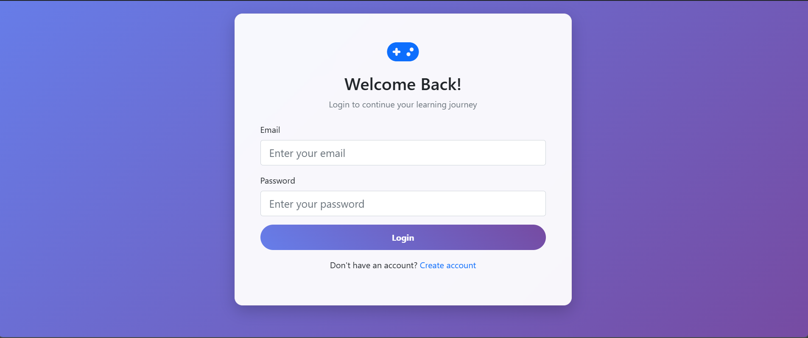
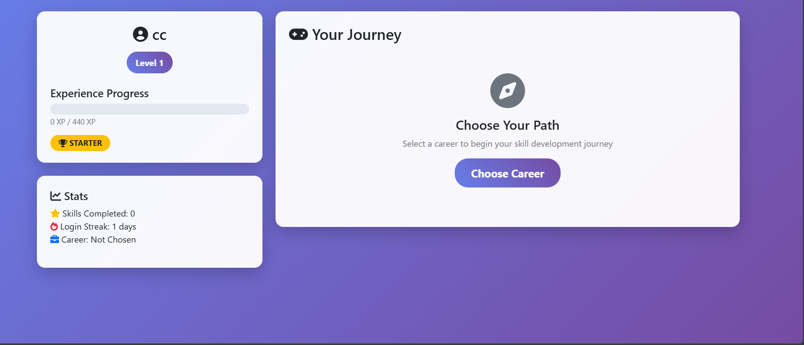
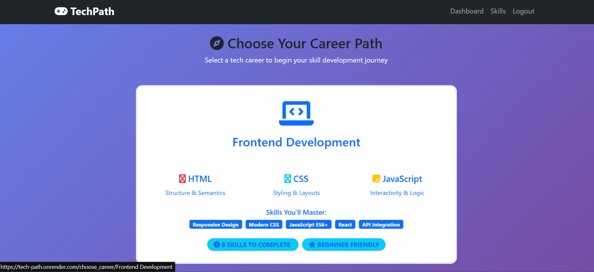
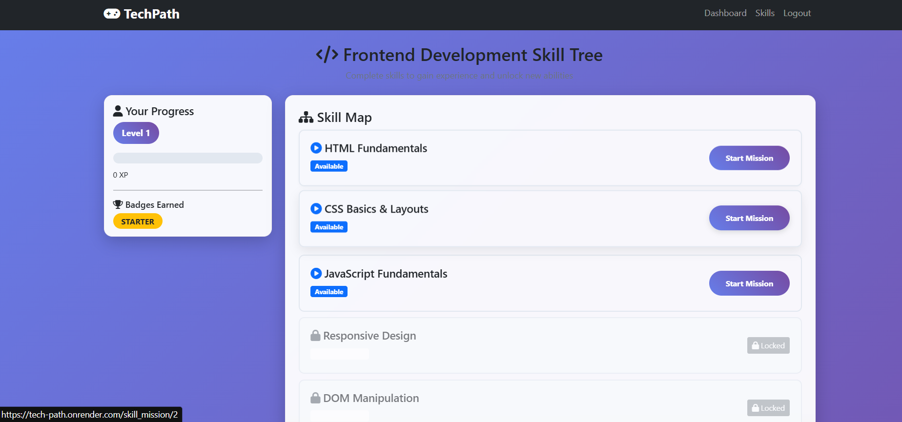
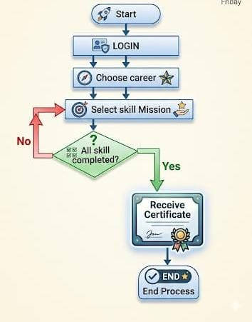

<p align="center">
  
</p>

# [TechPath] 🎯

## Basic Details :Tech-Path is a gamified career guidance and skill development web application that helps users follow structured learning roadmaps based on their chosen career path. It tracks progress using XP and levels, making skill-building more engaging and goal-oriented than traditional learning methods.

### Team Name: [BitPair]

### Team Members
- Member 1: [Ashika K P] - [College Of Engineering Thalassery]
- Member 2: [Rhthikna P V] - [College Of Engineering Thalassery]

### Hosted Project Link
[https://tech-path.onrender.com/]

### Project Description
[Tech-Path is a simple gamified career guidance and skill development web application that helps users explore structured career paths and track their learning progress. It provides step-by-step skill missions, XP-based leveling, and achievement badges to make skill-building interactive and goal-oriented. The platform transforms career planning into an engaging, game-like experience.]

### The Problem statement
[Tech-Path solves the problem of career confusion and unstructured skill development among students and beginners. Many learners struggle to identify the right skills for their desired career and often follow random, disconnected courses without a clear roadmap. Unlike boring and passive learning methods, Tech-Path provides a simple gamified, step-by-step learning path with missions, XP, and progress tracking to make skill-building structured, engaging, and goal-oriented]

### The Solution
[Tech-Path solves this problem by providing structured, career-specific learning roadmaps combined with gamification. Instead of random courses, users select a career path and receive step-by-step skill missions designed in the correct learning order. The platform tracks progress using XP, levels, and achievements, making learning interactive, measurable, and more engaging than traditional passive methods.

---

## Technical Details

### Technologies/Components Used

**For Software:**
- Languages used: [Python, HTML, CSS]
- Frameworks used: [Flask (Backend Web Framework), Bootstrap (Frontend Styling Framework)]
- Libraries used: [Flask-SQLAlchemy (Database ORM), Gunicorn (Production Server)]
- Tools used: [VS Code, Git & GitHub, Render (Cloud Deployment Platform), Jinja2 (Flask templating engine)]

**For Hardware:**
- Main components: [List main components]
- Specifications: [Technical specifications]
- Tools required: [List tools needed]

---

## Features

List the key features of your project:
- Feature 1: [Career-Based Skill Roadmaps : Users can select a desired career path and receive a structured, step-by-step learning roadmap tailored to that field.]
- Feature 2: [Gamified Learning System :The platform uses XP points, levels, and achievement badges to make learning interactive and more engaging than traditional passive methods.]
- Feature 3: [Progress Tracking Dashboard :Users can track completed skills, monitor their progress, and see how close they are to becoming job-ready.]
- Feature 4: [User Authentication System: Secure registration and login system to personalize learning paths and store user progress]

---

## Implementation

### For Software:

#### Installation
```bash
[Installation commands - pip install -r requirements.txt]
```

#### Run
```bash
[Run commands - python app.py]
```

### For Hardware:

#### Components Required
[List all components needed with specifications]

#### Circuit Setup
[Explain how to set up the circuit]

---

## Project Documentation

### For Software:

#### Screenshots (Add at least 3)

![Screenshot1 : Login]
*this is the login page user can 1st  register then log into the page*
<p>
  
</p>


![Screenshot2 : Dashboard]
*This page shows the Progress of the user *
<p>
  
</p>

![Screenshot3 : Career Selection]
*User can selecte the career they like *
<p>
  
</p>

![Screenshot4 : Skill map]
*Its a skill tree user can complete each skill to unlock next *
<p>
  
</p>
#### Diagrams

**System Architecture:**


*Tech-Path uses a client–server architecture where the frontend (HTML, CSS, Bootstrap) handles user interaction and the backend (Flask) manages logic and routing. User data such as progress, XP, and completed skills are stored in SQLite using SQLAlchemy ORM. When a user performs an action, the request flows from the browser to Flask, which updates the database and returns the updated results to the UI. The application is deployed using Gunicorn on Render for production hosting*
<p>
  
</p>

**Application Workflow:**
<p>
  
</p>

*The Tech-Path system follows a user-driven workflow architecture where users first authenticate, select a career path, and complete structured skill missions. The backend (Flask + SQLAlchemy) manages user data, progress tracking, XP, and completion logic using a relational database. Once all required skills are completed, the system automatically triggers certificate generation. The application is deployed using Gunicorn on Render, enabling scalable and accessible web-based interaction*


---

## Additional Documentation

### For Web Projects with Backend:

#### API Documentation

**Base URL:** `https://tech-path.onrender.com/


## Project Demo

### Video
[Add your demo video link here - https://drive.google.com/file/d/1MWlIlWfJAlQzyy-u32qRKWkZK5prsy_E/view?usp=sharing]

*Explain what the video demonstrates - key features, user flow, technical highlights*


---

## AI Tools Used (Optional - For Transparency Bonus)

If you used AI tools during development, document them here for transparency:

**Tool Used:** [ GitHub Copilot,ChatGPT, WindSurf]

**Purpose:** [What you used it for]
- Helped debug deployment issues (Git, Render configuration, Gunicorn setup).

-Provided guidance for database schema design and SQLAlchemy integration.

-Assisted in writing documentation, project descriptions, and system architecture explanations.

-Suggested improvements for code structure, error handling, and deployment workflow.

**Key Prompts Used:**
- "Step-by-step deployment process for Flask app using GitHub and Render”

-“Fix UNIQUE constraint failed error in Flask-SQLAlchemy”

-“How to push project and images to GitHub using Git”

**Percentage of AI-generated code:** [Approximately 45-55%]

**Human Contributions:**
- Architecture design and planning
- Custom business logic implementation
- Integration and testing
- UI/UX design decisions

*Note: Proper documentation of AI usage demonstrates transparency and earns bonus points in evaluation!*

---

## Team Contributions

- [Ashika]: [Specific contributions - e.g., Backend development, API integration,Git push etc.]
- [Rhthikna]: [Specific contributions - e.g.,Frontend development, Database design,Documenting etc.]

---

## License

This project is licensed under the [MIT License] License - see the [LICENSE](LICENSE) file for details.

**Common License Options:**
- MIT License (Permissive, widely used)
- Apache 2.0 (Permissive with patent grant)
- GPL v3 (Copyleft, requires derivative works to be open source)

---

Made with ❤️ at TinkerHub
